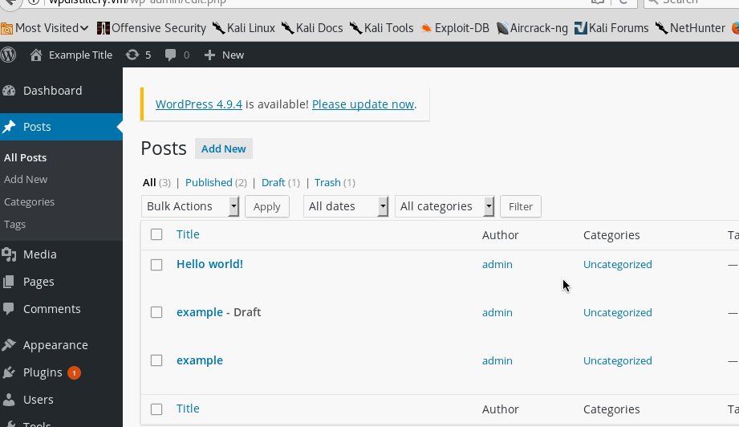
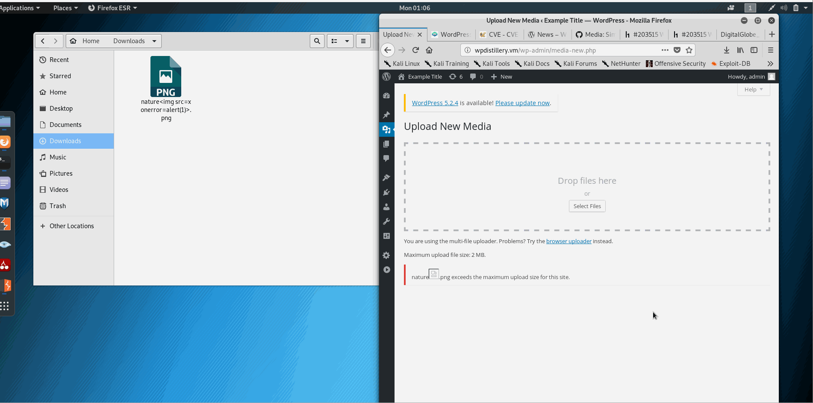
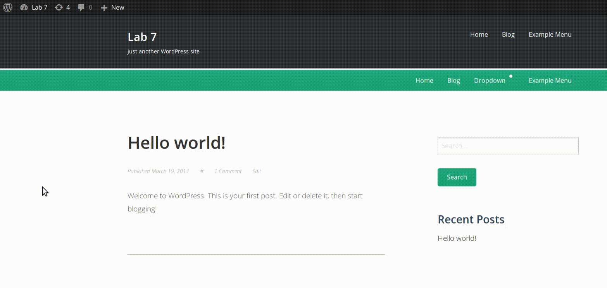

# Web_Security_CCNY

### 1. (Required) Vulnerability Name or ID: Authenticated Stored Cross-Site Scripting(XSS1)
  - [x] Summary: 
    - Vulnerability types: XSS
    - Tested in version: 4.2
    - Fixed in version: 4.2.3
  - [x] GIF Walkthrough: 
    - 
  - [x] Steps to recreate: 
    - Create a new post, and then put this code ```<a onmouseover= "alert('I got you!')" >click here</a>``` in the content link. Finally click link to show message in the preview of post.
  - [x] Affected source code:
    - [Link 1](https://core.trac.wordpress.org/browser/branches/4.2/src/wp-includes/class-wp-editor.php?rev=33361)

### 2. (Required) Large File Upload Error XSS
  - [ ] Summary: In WordPress before 4.7.5, a cross-site scripting (XSS) vulnerability exists when attempting to upload very large files, because the error message does not properly restrict presentation of the filename. 
    - Vulnerability types: XSS
    - Tested in version: 4.2
    - Fixed in version: 4.7.5
  - [ ] GIF Walkthrough:
  
  - [ ] Steps to recreate:
  I created a large image file and uploaded the manipulated name to pass a script:

  In this page:
  ```http://wpdistillery.vm/wp-admin/media-new.php```
  uploaded image with name:
  ```nature.png```
  - [ ] Affected source code:
    - [Link](https://github.com/WordPress/WordPress/commit/8c7ea71edbbffca5d9766b7bea7c7f3722ffafa6)
    
    ### 3. (Required) Authenticated Stored Cross-Site Scripting
  - [ ] Summary: Cross-site scripting (XSS) vulnerability in WordPress before 4.2.3 allows remote authenticated users to inject arbitrary web script or HTML by leveraging the Author or Contributor role to place a crafted shortcode inside an HTML element, related to wp-includes/kses.php and wp-includes/shortcodes.php.
    - Vulnerability types: XSS
    - Tested in version: 4.2
    - Fixed in version: 4.2.3
  - [ ] GIF Walkthrough:
  
  - [ ] Steps to recreate: 
  To recreate this exploit, I placed the following script in the HTML edit post box:
  ```
  <a href="[caption code=">]</a><a title=" onmouseover=alert('test')  ">link</a>
  ```
which resulted in the execution of a script without any click or otherwise.
  - [ ] Affected source code:
    - [Link](https://klikki.fi/adv/wordpress3.html)
